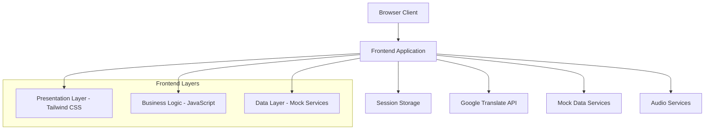

# Design Document

## Overview

SEED is a desktop web application designed to provide small loans ranging from $50 to $5000 to low-income individuals (investees) and connect them with investors through an accessible, visually-driven interface. The platform emphasizes graphical representation of financial data, multi-language support, and professional design to build trust while remaining accessible to users with limited financial literacy. SEED helps users grow their financial opportunities from small beginnings.

## Architecture

### System Architecture



### Technology Stack

- **Frontend Framework**: Vanilla JavaScript with modern ES6+ features
- **Styling**: Tailwind CSS for utility-first styling
- **Charts/Visualization**: Chart.js for financial data visualization
- **Translation**: Google Translate API integration
- **Audio**: Web Speech API for text-to-speech functionality
- **Storage**: SessionStorage for user preferences
- **Build Tools**: Vite for development and bundling

## Components and Interfaces

### 1. Authentication Module

**Login Component**
- Phone number input with validation
- Role selection (Investor/Investee) 
- Currency selection dialog with popular currencies
- OTP input field
- Professional form styling with Tailwind CSS

**Welcome Animation Component**
- 1-second personalized message display
- Smooth transitions and animations
- Role-based messaging

### 2. Language and Currency Management System

**Language and Currency Selector Component**
- Initial language and currency selection page for new users
- Persistent dropdowns in header for both language and currency
- Integration with Google Translate API
- SessionStorage persistence for both preferences

**Translation Service**
- Google Translate API wrapper
- Caching mechanism for translated content
- Fallback handling for API failures

**Currency Service**
- Currency formatting and display logic
- Support for multiple currencies (USD, EUR, INR, etc.)
- Real-time currency conversion for financial displays

### 3. Dashboard Components

**Financial Visualization Dashboard**
- Income/Expense charts using Chart.js including pie charts for income categories
- Professional color scheme (blues, greens, grays)
- Responsive grid layout
- Visual indicators for financial health
- Pie chart visualization for income source breakdown

**Data Input Components**
- File upload interface for Excel files
- Photo upload placeholder (UI only)
- Manual data entry forms
- Progress indicators and confirmations

### 4. Credit Assessment Module

**Credit Score Display**
- Circular progress indicator for credit score
- Color-coded scoring (red: poor, yellow: fair, green: good)
- Visual loan eligibility indicators
- Tenure recommendation cards

**Audio Explanation Service**
- Text-to-speech integration
- Speaker icon with play/pause controls
- Multi-language audio support
- Simple, clear explanations

### 5. Testimonials Section

**Testimonial Cards**
- Professional card layout
- User photos (mock data)
- Quote styling with proper typography
- Impact metrics visualization
- Responsive grid display

## Data Models

### User Model
```javascript
{
  id: string,
  phoneNumber: string,
  role: 'investor' | 'investee',
  language: string,
  currency: string,
  isAuthenticated: boolean,
  profile: {
    name: string,
    profession: string,
    location: string
  }
}
```

### Financial Data Model
```javascript
{
  userId: string,
  income: {
    monthly: number,
    sources: Array<{source: string, amount: number}>
  },
  expenses: {
    monthly: number,
    categories: Array<{category: string, amount: number}>
  },
  creditScore: number,
  loanEligibility: {
    maxAmount: number, // Range: $50 - $5000
    recommendedTenure: number,
    interestRate: number
  }
}
```

### Testimonial Model
```javascript
{
  id: string,
  name: string,
  profession: string,
  story: string,
  impact: {
    loanAmount: number,
    businessGrowth: string,
    timeframe: string
  },
  photo: string
}
```

## Error Handling

### API Error Handling
- Google Translate API failures: Fallback to default language
- Network connectivity issues: Cached content display
- Invalid file uploads: Clear error messages with retry options

### User Input Validation
- Phone number format validation
- File type and size restrictions
- Form field validation with real-time feedback

### Graceful Degradation
- Audio features fallback to text display
- Chart rendering fallbacks to simple tables
- Translation failures show original content

## Testing Strategy

### Manual Testing Approach
- Cross-browser compatibility testing
- Responsive design validation
- User flow testing for both roles
- Language switching functionality
- File upload interface testing

### Mock Data Testing
- OTP authentication flow (always "908978")
- Credit score calculation algorithms
- Financial data visualization
- Testimonial content display

## UI/UX Design Specifications

### Color Palette
- Primary: #1E40AF (Professional Blue)
- Secondary: #059669 (Success Green)
- Accent: #DC2626 (Warning Red)
- Neutral: #6B7280 (Gray)
- Background: #F9FAFB (Light Gray)

### Typography
- Headers: Inter font family, bold weights
- Body text: Inter font family, regular weights
- Financial data: Monospace for numbers

### Layout Principles
- Mobile-first responsive design
- 12-column grid system using Tailwind
- Consistent spacing using Tailwind spacing scale
- Clear visual hierarchy with proper contrast ratios

### Accessibility Features
- High contrast color combinations
- Large touch targets (minimum 44px)
- Clear focus indicators
- Screen reader friendly markup
- Audio alternatives for visual content

## Professional Design Elements

### Visual Hierarchy
- Clear navigation structure
- Prominent call-to-action buttons
- Consistent card-based layouts
- Professional iconography

### Trust Building Elements
- Professional color scheme
- Consistent branding
- Clear data presentation
- Testimonial social proof
- Security indicators

### User Experience Enhancements
- Smooth page transitions
- Loading states and progress indicators
- Intuitive navigation patterns
- Clear feedback for user actions
- Contextual help and guidance